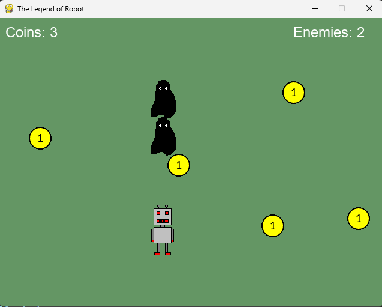
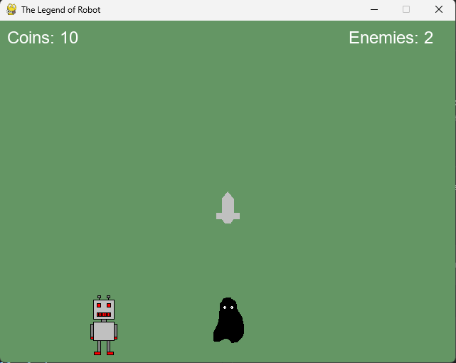
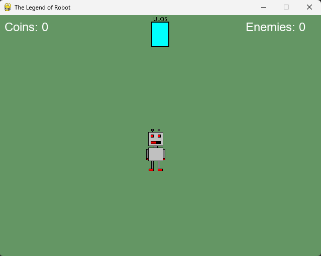
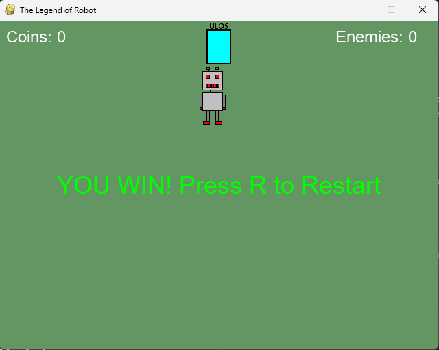
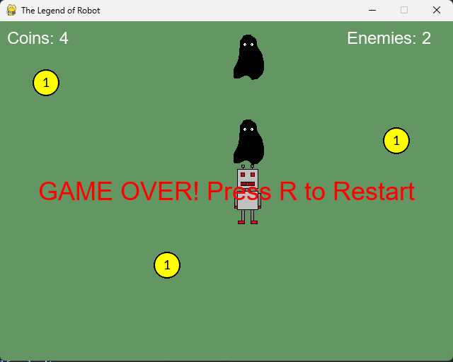

# The Legend of Robot

A 2D state-based game using as reference the franquise The Legend of Zelda.

## Project overview
An adventure game about taking enough coins to buy a sword to kill the enemies and escape using pygame.

Image of the game:



Image of sword spawning at having 10 coins:



Image of portal spawning after defeating all the enemies:



Image of winning the game after enter the portal:



Image of game over after touch an enemy without the sword:




## Project Structure
- `screenshots/`: Screenshots of the game.
- `src/`: The game logic and images.
- `src/main.py`: Main code of the program.
- `src/coin.png/door.png...`: Sprites of the program.

## Prerequisites
Before running this project, ensure you have the following installed:
- **Python 3.12+**
- **Git**: To clone this repository use:
```powershell
git clone https://github.com/lsuafonso/The-Legend-of-Robot.git
```
- **Pygame**: You can install it using:
```powershell
pip install -r requirements.txt
```

## How to run
To run the project use the following command in the powershell:
```powershell
# Run this from the project root folder
python src/main.py
```

---
*Developed by Luis Suárez Afonso*